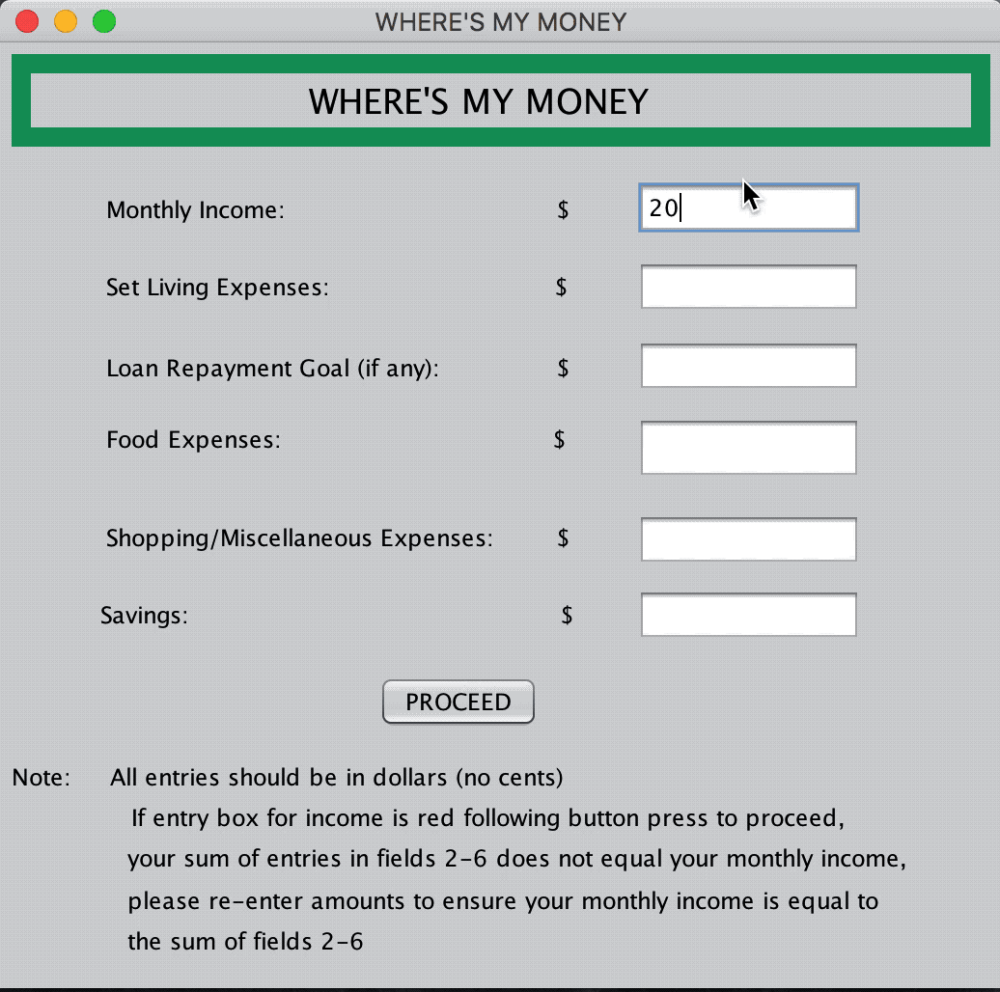
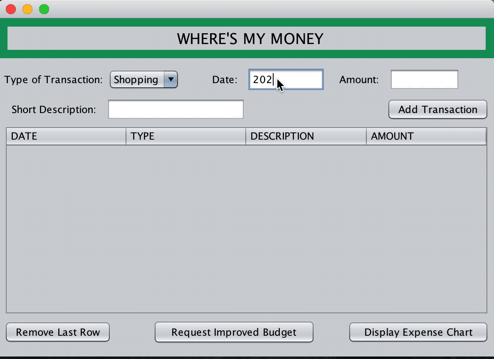
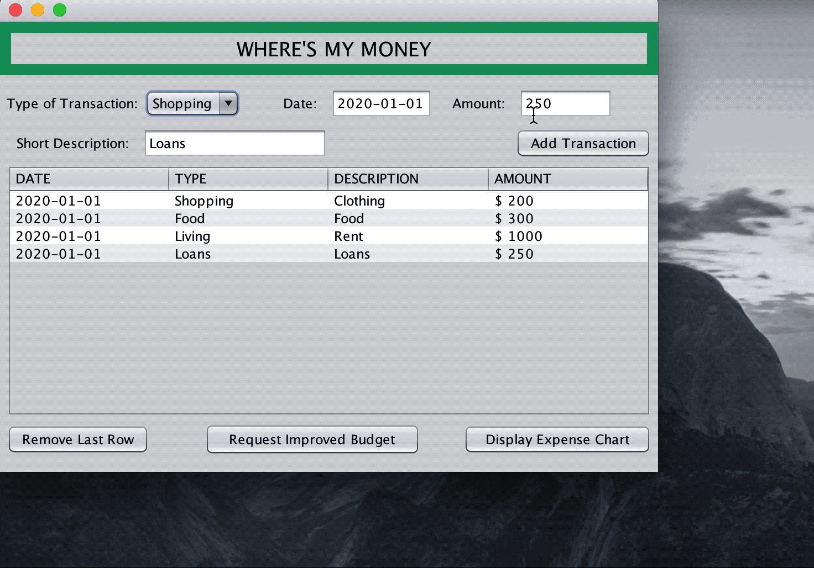

# Where’s My Money?

## Overview
A personal finance manager that allows you to stick to your budget and provides recommendations on how best to use your money.
 
 

The app takes a user's inputted estimation of their monthly spending, then allows one to add single transactions categorized by their type, date, amount and a short description for clarity. As transactions are inputted, the user will be warned if any transactions reach or exceed the previously set limits.
 
 
 

All transactions are displayed to the user and can be removed as needed. The user can then request a new recommended budget that is based on the transactions they have added. 
 
 
 

The new budget does not change fixed expenses such as living, savings and loan repayments and returns new limits for food and shopping expenses based on the respective inputted transactions. In the case that the user does not spend all of the allocated budget for either food or shopping, the excess amount is added to the loan repayment budget. The user may also view a graphical breakdown of their transaction history.
